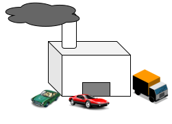
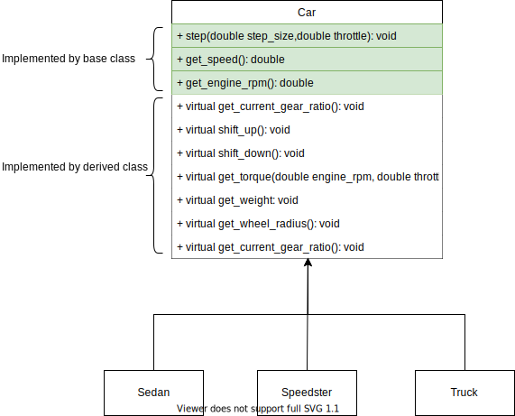

# 270191U025-Software-Architecture-assignment-9

In the last lecture you were introduced to several design patterns.
These patterns are common building blocks which can be used to design software which is robust, extensible and easy to maintain.
In general these can be divided into categories, based on which aspect of the application they apply to:

- Behavioural, how do classes interact with each other.
- Creational, decouple client from creation of objects.
- Structural, composing multiple class or objects.

Until now you have mostly seen examples of behavioural in the exercises such as, such as the strategy, visitor and observer patterns.
Today we will be working with the follwing pattern:

- Template Method

We will examine the design pattern in the context of car manufacturing plant.
To keep up with the fierce competition is necessary to produce several different types of cars and trucks.
Your boss has personally tasked you with designing next years lineup.
He is an impatient man so you feel that it is better getting started now rather than later!

<div>

</div>

## Template Method Pattern

The goal of the template method pattern is to encapsulate the steps required to perform a task (an algorithm) in a class but instead of relying on the baseclass to do all the individual steps.
A benefit that the complex logic can be isolated to the base class rather than being repeated in every derived class.

The figure below shows 4 classes:

- Car: defines an algorithm for simulating the speed of a `Car` based on the particular choice of engine.
- Sedan, Speedster and Truck: concrete implementations of `Car` that implement methods for calculating energy produced by the

<div>

</div>

A short summary of the `Car`'s methods:

1. `step`: updates the speed of the car based on the torque produced by the engine.
2. `get_speed`: returns the speed of the vehicle measures in m/s (multiply by 3.6 to convert to km/h).
3. `get_engine_rpm` : returns the rotation speed of the engine
4. `get_current_gear_ratio` : returns the gearing ratio between engine and the wheels. For example a gearing ratio of 2 implies that the engine twice as fast as the wheels.
5. `shift_up` and `shift_down` : increases or decreases the gearing ratio.
6. `get_torque`: returns the torque (a twisting force) generated by the engine for a particular level of throttle and RPM.
7. `get_weight`: returns the weight of the vehicle.
8. `get_wheel_ratio` : returns the radius of the wheel.

Note that only the virtual methods have to be implemented, in the derived classes.
This allows the base class to calculate the acceleration (update in speed) by calling the methods implemented by the derived class, as seen below:

```cpp
// car.hpp
void step(double step_size, double throttle)
{
   if (throttle > 1.0 || throttle < 0)
   {
      throw std::invalid_argument("throttle must be between 0.0 and 1.0");
   }

   // you dont need to understand this bit
   double torque_wheels = get_current_gear_ratio() * get_torque(get_engine_rpm(), throttle);
   double force_wheels = torque_wheels / this->get_wheel_radius();
   double acceleration = force_wheels / get_weight();

   // Forward Euler (https://en.wikipedia.org/wiki/Euler_method)
   this->car_speed_ms += step_size * acceleration;
}
```

It is not essential that you understand the process of modelling the cars speed, but if you are interested you can look at:

https://x-engineer.org/automotive-engineering/chassis/vehicle-dynamics/calculate-wheel-torque-engine/

## Exercise

1. Examine the `car.hpp`, `sedan.hpp`, `sedan.cpp` and `test_cars.cpp` files.
2. Run the tests to check to see if they pass. Initially they should fail with output like:
   ```bash
   ...
   [ctest] time: '9.6': speed of the car is:'0' ms/s and engine rpm is: '0'
   [ctest] time: '9.7': speed of the car is:'0' ms/s and engine rpm is: '0'
   [ctest] time: '9.8': speed of the car is:'0' ms/s and engine rpm is: '0'
   [ctest] time: '9.9': speed of the car is:'0' ms/s and engine rpm is: '0'
   ```
   This is no surprise since the methods are not yet implemented.
3. Implement the `shift_up`, `shift_down`, `get_weight`, `get_wheel_radius` and `get_current_gear_ratio`, `get_torque`.
   In reality the torque generated by a car depends on the rotation speed of its engine, i.e. it has a sweetspot where it operates well.
   For the exercise you up with a simple model of the torque generated by the engine based, for example, constant torque multiplied by the throttle:
   `torque = 100 Nm * throttle`

   As for the wheel radius and weight, you can rough estimates like 0.3 m and 2000 kg.

4. Rerun the tests and check the output. Tweak your implementation until the car reaches the speed specified by the test.

   Tip: if your car is going too slow you can make it lighter or make it produce more torque.
   If it is going to fast to can make it heavier or reduce the torque produced.
